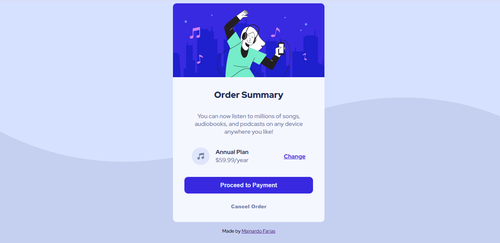

# Order-summary-component

Olá a todos. Este projeto é um simples componente em formato de card que simula o resumo de compra de uma assinatura de streaming de música em . 
 feito apenas com HTML e CSS
## Contents

- [Overview](#overview)
  - [Screenshot](#screenshot)
- [My process](#my-process)
  - [Built with](#built-with)
  - [Continued development](#continued-development)
  - [Useful resources](#useful-resources)
- [Author](#author)

## Overview

### Screenshot

- Desktop preview

- Mobile preview (375px)

## My process

### Built with

- Semantic HTML5 markup
- CSS custom properties
- Flexbox
- Mobile-first workflow

### Continued development

Lembrando que a responsividade é um ponto muito importante no Desenvolvimento Web, sendo assim, sempre foco em desenvolver meus projetos focando em Mobile-first, para que a experiência do usuário seja agradável em todas as plataformas.

### Useful resources

- [Site MDN Web Docs ](https://developer.mozilla.org/pt-BR/) - A maioria dos web devs já devem conhecer este site mas irei fixar o link dele aqui para enfatizar a importância de fontes que ajudam na hora do desenvolvimento de aplicações web.

## Author

- Linkedin - [Mainardo Farias](https://www.linkedin.com/in/mainardo-farias/)
